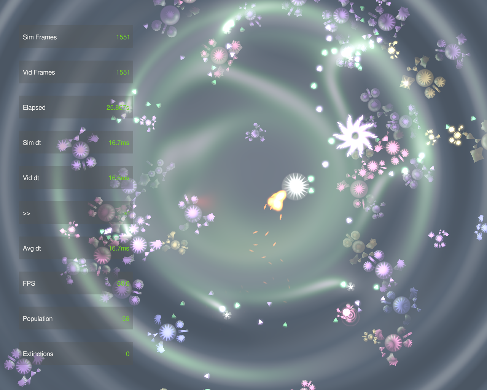
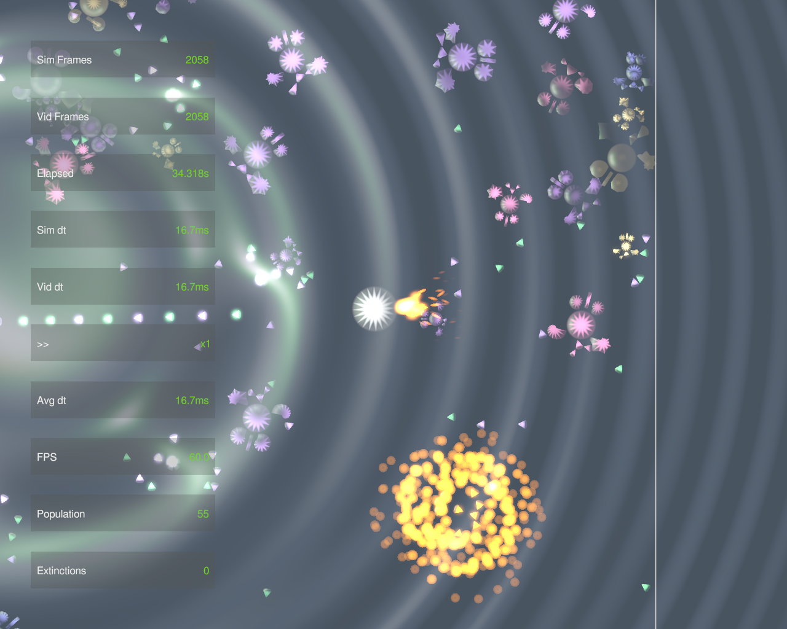

## Rust-oids

A Rust-based A-life playground, for Linux (tested on Devuan Ceres) and Windows 10.

## Simulation

Here's roughly how the simulation works. There are 3 types of agents in the world:

### Resources. 
These are spawned at a fixed rate by Emitters. Their lifespan is very short and their only purpose is to provide nourishment for the Minions. Minions can detect nearby Resources with their sensor, and detect the nearest Emitters at any distance.

### Minions. 
These are the little rustoid critters.
- Each Minion shape and behaviour is determined by its, practically unique, **genotype**, which is basically just a string of bits.
- Body plan, limb geometry and mass distribution are fully simulated via the box2d **physics** engine.
- Body plan, gender, appearance, and brain aspects of the **phenotype** of each Minion are fully determined by its genetic code.
- Each Minion's **brain** is implemented via a simple 3 layer neural network. Brain has no learning capabilities, all behaviour is hardcoded at birth by genotype alone.
- Each Minion has a **sensor** to detect nearby Resources and the nearest Emitter, among other variables.
- Up to 4 **inputs** from the **sensor** determine the **outputs** of the brain which enable **actuators** if their value exceed certain **personality**-dependent **thresholds**. Left and right **rudders** which exert pull, **thrusters** push, and a linear **brake** reduces forward speed.
- Each action by a Minion, including waiting idle and reproducing, consumes a certain amount of **energy**. When energy is depleted, the Minion **dies** and some of its body is released back as Resources.
- Minions who **eat** resources can top-up their energy pool, survive longer and **grow**
- Minions who grow enough to reach **maturity** will **reproduce** via **spores**.
- Minions who are unsuccessful at finding and eating food will not leave offspring driving their lineage **extinct**. 

### Spores.
- The little 5-lobed balls produced by the Minions by means of which they **reproduce**.
- During reproduction, the genotype is transmitted but the process introduces a variable number of **mutations**. Each mutation flips a random bit of the genotype.
- After a short time, Spores **hatch** into Minions.
- If an unfertilized Spore is touched by a Minion of a different **gender**, of which there are four, it acquires its genetic material and the resulting Minion will have a gene which is a **crossover** of the two.

The intriguing bit about all of this is that AI, body shape and brain are **bred** via *artificial natural selection* - for want of a better name. Practically all observed behaviour is **emergent**.

Eventually I plan to plug in some sort of gameplay and release as a free game. Strictly evening/weekend toy project: don't hold your breath.

### Interaction

You can interact with the simulation by shooting Resources at the minions. **Gamepad** supported.

## Feedback
- feel free to post [issues on GitHub](https://github.com/itadinanta/rust-oids/issues)
- also send me interesting gene pools (F6/F7 to get snapshots, see instructions below)

## Acknowledgements

This project started as a test bed for the Rust language and toolchain, [GFX](https://github.com/gfx-rs/gfx) and [box2d wrapper](https://github.com/Bastacyclop/rust_box2d), and could have not existed without those.

## Videos/Screenshots

Some rust-oids competing for territory and resources, and the player messing up with them!

[](https://youtu.be/_854pBbodps "Click to watch video")





## Prerequisites/platforms

I've built on Ubuntu GNU/Linux, Devuan Ceres GNU/Linux and Windows 10.

On Linux, aside from the full Rust toolchain, the following packages are required (I use `apt install`, adjust for your own distro):

For Box2D:

- cmake

For audio:

- libportaudio19-dev
- libasound2-dev

For gamepad:

- libudev-dev

### Windows

`cmake` can be installed via https://scoop.sh/ typing `scoop install cmake`

Building Windows dependencies is a tedious yak shaving exercise. For convenience, I am redistributing parts of open source projects in the form of headers and prebuilt x64 static libs for Windows 10.
Links to the source code are provided below as for licences:

- `portaudio` http://www.portaudio.com/, http://www.portaudio.com/license.html

## Build/run

- Clone this repo and ```cd``` into its root
- ```cargo run --release``` run with defaults
- ```cargo run --release -- [<gene_pool_file.csv>] [options]``` 

Options:

`<gene_pool_file.csv>`
:  use the specified gene pool (`DDDDMMYYY_hhmmss.csv`).

`-t`
:  text mode, headless. Simulates as fast as possible, saves every 5 minutes. 

`-f I`
:  runs in fullscreen on given monitor index I (`-f 0`)

`-w W`, `-h H`
:  optional window size (`-w 1280 -h 900`)

`-i <snapshot file>`
:  Load from specific snapshot (`-i ~/.config/rust-oids/saved_state/20180423_234300.json`)

`-n`
:  Ignore last snapshot, start from new population"

`-a <device index>`
:  Audio device index (portaudio)", "0" (`-a 0`)


## How to play

Gamepad is supported (tested with DS4, in Windows via [DS4Windows](http://ds4windows.com/))

- Left stick, WASD: move
- Right stick, Q, E: aim
- L2: fire rate
- R2, Spacebar: shoot
- L1, G/R1, H: slow down/fast forward
- L3, F1: toggle HUD
- Left mouse click: aim and shoot
- Middle mouse click: new rustoid from current gene pool.
- 1, R3: zoom reset
- Ctrl + Middle mouse click: new random rustoid.
- Ctrl + Left mouse clik: select minion for tracing
- Z: deselect minion for tracing
- F1,L3: toggle HUD
- F5: reload shaders (development)
- F6: snapshot current gene pool into the **resources** folder
- F7: quick save
- F8: reload last save
- V,B: set background tone
- K,L: change light intensity
- 0, Home: reset camera pan

### Other licences

For convenience, I have added some `FreeFont` assets, which are used in the Conrod GUI.
https://www.gnu.org/software/freefont/

## Keywords

rust rustlang testbed ai alife ann neural network genetic algorithm gfx box2d wrapper2d hdr msaa alpha tonemapping shader fragment pixel vertex geometry pso gamedev
